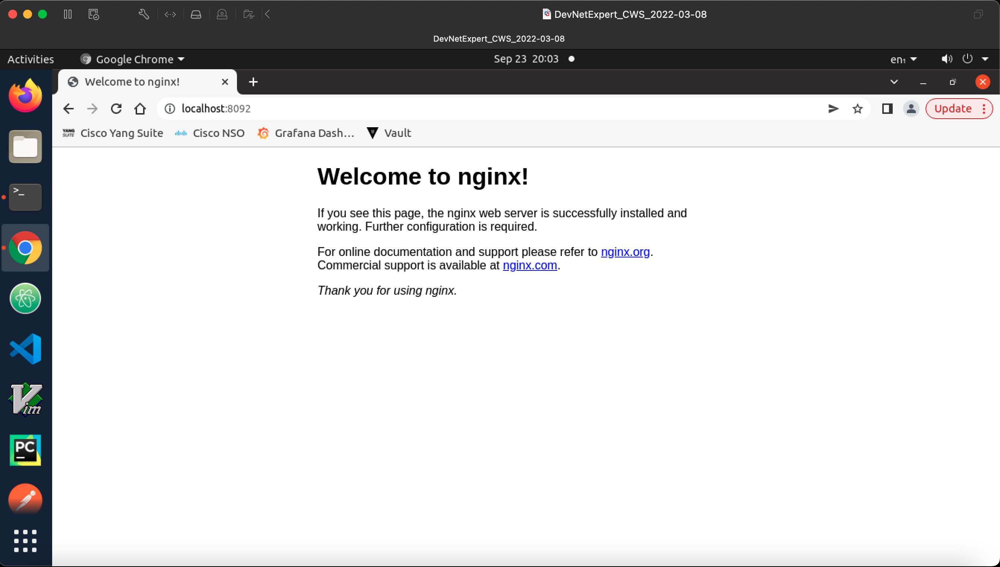

##### Manage Kubernestes resource via Kubectl command line

I am running all these command under devnet-namespace, however you use default namespace, without `-n <namespace-name>` or `--namespace=<namespace-name>`

###### Run a Pod via kubectl command

`kubectl run my-nginx-pod --image=nginx:latest`

```bash
(main) expert@expert-cws:~$ kubectl run my-nginx-pod --image=nginx:latest
pod/my-nginx-pod created
(main) expert@expert-cws:~$ kubectl get pods
NAME           READY   STATUS              RESTARTS   AGE
my-nginx-pod   0/1     ContainerCreating   0          5s
(main) expert@expert-cws:~$ kubectl delete pods my-nginx-pod
pod "my-nginx-pod" deleted
(main) expert@expert-cws:~$ kubectl get pods
No resources found in default namespace.
(main) expert@expert-cws:~$ 
```

###### Create a Namespace via kubectl command

`kubectl create namespace devnet-namespace`

```bash
(main) expert@expert-cws:~$ kubectl create namespace devnet-namespace
namespace/devnet-namespace created
(main) expert@expert-cws:~$ 
(main) expert@expert-cws:~$ kubectl get namespace devnet-namespace
NAME               STATUS   AGE
devnet-namespace   Active   30s
(main) expert@expert-cws:~$ 
(main) expert@expert-cws:~$ kubectl get namespaces
NAME                   STATUS   AGE
default                Active   31d
devnet-namespace       Active   40s
kube-node-lease        Active   31d
kube-public            Active   31d
kube-system            Active   31d
kubernetes-dashboard   Active   28d
(main) expert@expert-cws:~$
(main) expert@expert-cws:~$ kubectl describe ns devnet-namespace
Name:         devnet-namespace
Labels:       kubernetes.io/metadata.name=devnet-namespace
Annotations:  <none>
Status:       Active

No resource quota.

No LimitRange resource.
(main) expert@expert-cws:~$ 
```

###### Create a Deployment via kubectl command

`kubectl create deployment nginx-deployment --replicas=1 --image=nginx:latest --port=80`
`kubectl create deployment nginx-deployment -n devnet-namespace --replicas=1 --image=nginx:latest --port=80`

```bash
(main) expert@expert-cws:~$ kubectl create deployment nginx-deployment -n devnet-namespace --replicas=1 --image=nginx:latest --port=80
deployment.apps/nginx-deployment created
(main) expert@expert-cws:~$ 
(main) expert@expert-cws:~$ kubectl get pods -n devnet-namespace 
NAME                                READY   STATUS    RESTARTS   AGE
nginx-deployment-684c85b7f4-rxhcl   1/1     Running   0          23s
(main) expert@expert-cws:~$ 
(main) expert@expert-cws:~$ kubectl get deployment -n devnet-namespace 
NAME               READY   UP-TO-DATE   AVAILABLE   AGE
nginx-deployment   1/1     1            1           32s
(main) expert@expert-cws:~$ 
(main) expert@expert-cws:~$ kubectl get replicaset -n devnet-namespace 
NAME                          DESIRED   CURRENT   READY   AGE
nginx-deployment-684c85b7f4   1         1         1       58s
(main) expert@expert-cws:~$ 
(main) expert@expert-cws:~$ kubectl rollout history deployment/nginx-deployment -n devnet-namespace
deployment.apps/nginx-deployment 
REVISION  CHANGE-CAUSE
1         <none>

(main) expert@expert-cws:~$ 
```
To check the detailed information for this deployment, use kubectl describe command
`$ kubectl describe deployment -n devnet-namespace`

You can you also add --output yaml flag in kubectl get command to get the output in yaml format, which is good to get and idea how the deployment file is created. 

`$ kubectl get deployments -n devnet-namespace --output yaml`

You may also use `kubectl edit deploy nginx-deployment -n devnet-namespace`, should you need to edit this deployment
```bash
(main) expert@expert-cws:~$ kubectl edit deploy nginx-deployment -n devnet-namespace
Edit cancelled, no changes made.
(main) expert@expert-cws:~$ 
```

###### Create a Service via kubectl command

`kubectl create service clusterip nginx-service --tcp=8090:80 -n devnet-namespace`
```bash
(main) expert@expert-cws:~$ kubectl create service clusterip nginx-service --tcp=8090:80 -n devnet-namespace
service/nginx-service created
(main) expert@expert-cws:~$ 
(main) expert@expert-cws:~$ kubectl get services -n devnet-namespace
NAME            TYPE        CLUSTER-IP      EXTERNAL-IP   PORT(S)    AGE
nginx-service   ClusterIP   10.104.67.118   <none>        8090/TCP   30s
(main) expert@expert-cws:~$ 
(main) expert@expert-cws:~$ kubectl describe service nginx-service -n devnet-namespace
Name:              nginx-service
Namespace:         devnet-namespace
Labels:            app=nginx-service
Annotations:       <none>
Selector:          app=nginx-service
Type:              ClusterIP
IP Family Policy:  SingleStack
IP Families:       IPv4
IP:                10.104.67.118
IPs:               10.104.67.118
Port:              8090-80  8090/TCP
TargetPort:        80/TCP
Endpoints:         <none>
Session Affinity:  None
Events:            <none>
(main) expert@expert-cws:~$ 
(main) expert@expert-cws:~$ minikube service list
|----------------------|---------------------------|--------------|-----|
|      NAMESPACE       |           NAME            | TARGET PORT  | URL |
|----------------------|---------------------------|--------------|-----|
| default              | kubernetes                | No node port |
| devnet-namespace     | nginx-service             | No node port |
| kube-system          | kube-dns                  | No node port |
| kubernetes-dashboard | dashboard-metrics-scraper | No node port |
| kubernetes-dashboard | kubernetes-dashboard      | No node port |
|----------------------|---------------------------|--------------|-----|
(main) expert@expert-cws:~$ 
```

Since this is a ClusterIP service and it is only accessible inside the cluster and to make it work outside cluster, we need to run the kubectl port-forward as below; But before we run the command, we need to make sure the labels are corrects to make service aware what pod it will need to forward the request to. Edit the deployment and service to match the labels.

To edit the deployment configuration 
`kubectl edit deploy nginx-deployment -n devnet-namespace`

I am only showing the interesting output and rest I will omit
```yaml
  template:
    metadata:
      creationTimestamp: null
      labels:
        app: nginx-deployment
    spec:
      containers:
      - image: nginx:latest
        imagePullPolicy: Always
        name: nginx
        ports:
        - containerPort: 80
          protocol: TCP
```

As you can see we have `app: nginx-deployment` under the template, metadata, label assign for the container, so we need to match this label in service configuration. 

To edit the service configuration 
`$ kubectl edit services -n devnet-namespace`

```yaml
spec:
  clusterIP: 10.104.67.118
  clusterIPs:
  - 10.104.67.118
  internalTrafficPolicy: Cluster
  ipFamilies:
  - IPv4
  ipFamilyPolicy: SingleStack
  ports:
  - name: 8090-80
    port: 8090
    protocol: TCP
    targetPort: 80
  selector:
    app: nginx-service
```

Notice you can see the `app: nginx-service` under the selector, we need to change this to `app: nginx-deployment` to match the deployment tag. If you have multiple tag, you need to make sure all tags are matching in selector for the service with the deployment tags.

Enabling Port forwarding for the ClusterIP service for debugging purpose
`kubectl port-forward service/nginx-service 8092:8090 -n devnet-namespace`

where 8092 --> port where service is listening for a request
      8090 --> port where service is forwarding the request to

```bash
(main) expert@expert-cws:~$ kubectl port-forward service/nginx-service 8092:8090 -n devnet-namespace
Forwarding from 127.0.0.1:8092 -> 80
Forwarding from [::1]:8092 -> 80
Handling connection for 8092
Handling connection for 8092
```

Once you enabled the port-forwarding, you can browse to the URL with the service IP (10.104.67.118) and the port number (8092).



You can also check the logs whilst accessing the service, get the pod name first and the run kubectl log command

```bash
(main) expert@expert-cws:~$ kubectl get pods -n devnet-namespace
NAME                                READY   STATUS    RESTARTS   AGE
nginx-deployment-684c85b7f4-rxhcl   1/1     Running   0          20h
(main) expert@expert-cws:~$ kubectl logs nginx-deployment-684c85b7f4-rxhcl -f -n devnet-namespace
/docker-entrypoint.sh: /docker-entrypoint.d/ is not empty, will attempt to perform configuration
/docker-entrypoint.sh: Looking for shell scripts in /docker-entrypoint.d/
/docker-entrypoint.sh: Launching /docker-entrypoint.d/10-listen-on-ipv6-by-default.sh
10-listen-on-ipv6-by-default.sh: info: Getting the checksum of /etc/nginx/conf.d/default.conf
10-listen-on-ipv6-by-default.sh: info: Enabled listen on IPv6 in /etc/nginx/conf.d/default.conf
/docker-entrypoint.sh: Launching /docker-entrypoint.d/20-envsubst-on-templates.sh
/docker-entrypoint.sh: Launching /docker-entrypoint.d/30-tune-worker-processes.sh
/docker-entrypoint.sh: Configuration complete; ready for start up
2022/09/22 23:29:11 [notice] 1#1: using the "epoll" event method
2022/09/22 23:29:11 [notice] 1#1: nginx/1.23.1
2022/09/22 23:29:11 [notice] 1#1: built by gcc 10.2.1 20210110 (Debian 10.2.1-6) 
2022/09/22 23:29:11 [notice] 1#1: OS: Linux 5.4.0-96-generic
2022/09/22 23:29:11 [notice] 1#1: getrlimit(RLIMIT_NOFILE): 1048576:1048576
2022/09/22 23:29:11 [notice] 1#1: start worker processes
2022/09/22 23:29:11 [notice] 1#1: start worker process 32
2022/09/22 23:29:11 [notice] 1#1: start worker process 33
127.0.0.1 - - [23/Sep/2022:19:58:58 +0000] "GET / HTTP/1.1" 200 615 "-" "Mozilla/5.0 (X11; Linux x86_64) AppleWebKit/537.36 (KHTML, like Gecko) Chrome/99.0.4844.51 Safari/537.36" "-"
2022/09/23 19:58:58 [error] 33#33: *1 open() "/usr/share/nginx/html/favicon.ico" failed (2: No such file or directory), client: 127.0.0.1, server: localhost, request: "GET /favicon.ico HTTP/1.1", host: "localhost:8092", referrer: "http://localhost:8092/"
127.0.0.1 - - [23/Sep/2022:19:58:58 +0000] "GET /favicon.ico HTTP/1.1" 404 555 "http://localhost:8092/" "Mozilla/5.0 (X11; Linux x86_64) AppleWebKit/537.36 (KHTML, like Gecko) Chrome/99.0.4844.51 Safari/537.36" "-"
```

Finally if you want to see all three resource, you can check via following command. 

`$ kubectl get all -n devnet-namespace`
```bash
(main) expert@expert-cws:~$ kubectl get all -n devnet-namespace
NAME                                    READY   STATUS    RESTARTS   AGE
pod/nginx-deployment-684c85b7f4-rxhcl   1/1     Running   0          20h

NAME                    TYPE        CLUSTER-IP      EXTERNAL-IP   PORT(S)    AGE
service/nginx-service   ClusterIP   10.104.67.118   <none>        8090/TCP   20h

NAME                               READY   UP-TO-DATE   AVAILABLE   AGE
deployment.apps/nginx-deployment   1/1     1            1           20h

NAME                                          DESIRED   CURRENT   READY   AGE
replicaset.apps/nginx-deployment-684c85b7f4   1         1         1       20h
(main) expert@expert-cws:~$ 
```

Finally, after practising this exercise, you can delete all of these objects as below

`kubectl delete all --all -n devnet-namespace`
```bash
(main) expert@expert-cws:~$ kubectl delete all --all -n devnet-namespace
pod "nginx-deployment-684c85b7f4-rxhcl" deleted
service "nginx-service" deleted
deployment.apps "nginx-deployment" deleted
replicaset.apps "nginx-deployment-684c85b7f4" deleted
(main) expert@expert-cws:~$ 
```

I have also created
