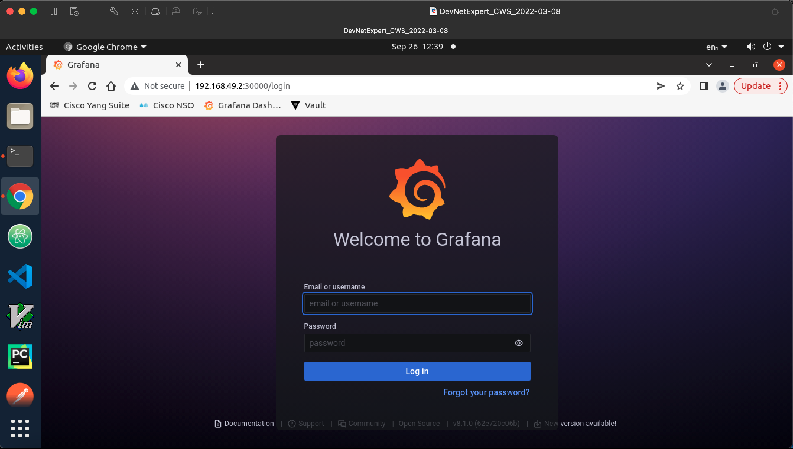
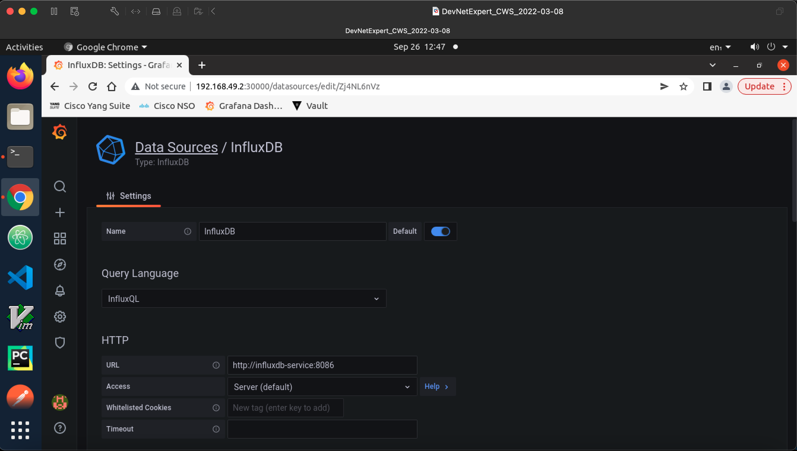
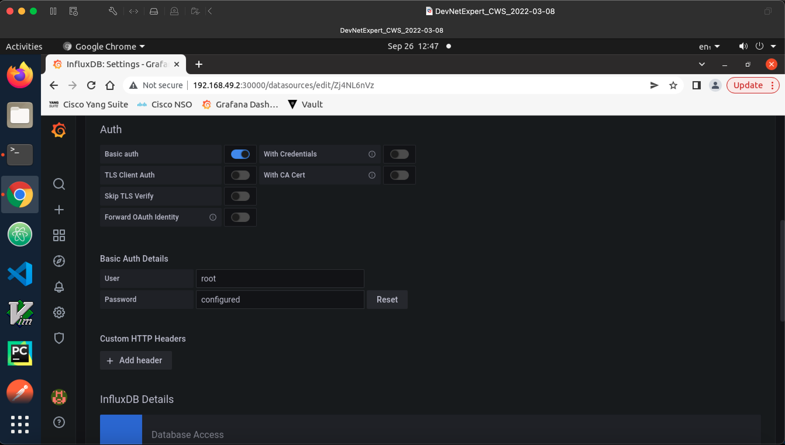
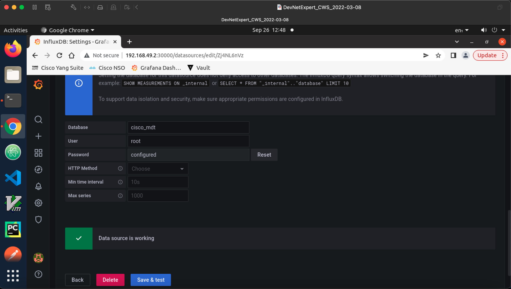

# Telegraf, InfluxDB, & Grafana (TIG) Stack on Kubernetes

- InfluxDB -v1.8
- Telegraf - v1.19
- Grafana - v8.1

### Create a new folder for configuration (menifest) files.

Let's create a new folder and `cd` into it, where we can put all the required Kubernetes configuration files to successfully run the TIG stack for model driven telemetry with Cisco devices.

```bash
(main) expert@expert-cws:~$ mkdir mdt-tig-k8s && cd mdt-tig-k8s
(main) expert@expert-cws:~/mdt-tig-k8s$ 
```

I am creating new namespace 'devnet-namespace' but you can use default namespace as well.

### Create a new namespace 'devnet-namespace' (optional)

```bash
(main) expert@expert-cws:~$ kubectl create namespace devnet-namespace
namespace/devnet-namespace created
(main) expert@expert-cws:~$ 
(main) expert@expert-cws:~$ kubectl get namespace devnet-namespace
NAME               STATUS   AGE
devnet-namespace   Active   30s
(main) expert@expert-cws:~$ 
(main) expert@expert-cws:~$ kubectl get namespaces
NAME                   STATUS   AGE
default                Active   31d
devnet-namespace       Active   40s
kube-node-lease        Active   31d
kube-public            Active   31d
kube-system            Active   31d
kubernetes-dashboard   Active   28d
(main) expert@expert-cws:~$
(main) expert@expert-cws:~$ kubectl config get-contexts
CURRENT   NAME       CLUSTER    AUTHINFO   NAMESPACE
*         minikube   minikube   minikube   default
(main) expert@expert-cws:~$
```

or create via configuration file

```yaml
apiVersion: v1
kind: Namespace
metadata:
  name: devnet-namespace
```

As you can see from the above output we have a new 'devnet-namespace' and currently default namespace is a default, for the ease of this toturial, I am going to make 'devnet-namespace' as default namespace, so we don't have to provide '-n devnet-namespace' flag for every command we run. If you are using a default namespace, you can feel free to skip this step.

```bash
(main) expert@expert-cws:~$ kubectl config set-context --current --namespace=devnet-namespace
Context "minikube" modified.
(main) expert@expert-cws:~$
(main) expert@expert-cws:~$ kubectl config get-contexts
CURRENT   NAME       CLUSTER    AUTHINFO   NAMESPACE
*         minikube   minikube   minikube   devnet-namespace
(main) expert@expert-cws:~$ 
```

You can you also use `$ kubectl config vieww` to see the full Kubectl config.

## InfluxDB POD Setup in Kubernetes

As you know InfluxDB is one of the main componenet in TIG stakc, we will deploy this first, but before we deploy, we need to look at the K8s resources we need to setup a InfluxDB container in Kubernestes.

- SecretMap: To store the InfluxDB name, credentials, etc. It keeps the data in base64 encode.
- ConfigMap: Create a config for influxdb config and service
- Persistent Volume (pv): Create a persistent volume for influxdb to claim volume. (optional)
- Storage Class (sc): Dynamically create volume for the influxdb. (optional)
- Persistent Volume Claim (pvc): Volume claim for Influxdb data.
- Deployment: Deploy influxdb POD and replicas.
- Service: Expose influxdb ports via service with in the cluster

#### Create InfluxDB SecretMap

```s
kubectl create secret generic influxdb-creds \
  --from-literal=INFLUXDB_DB=cisco_mdt \
  --from-literal=INFLUXDB_ADMIN_USER=root \
  --from-literal=INFLUXDB_ADMIN_PASSWORD=telegraf \
  --from-literal=INFLUXDB_USER=murafi \
  --from-literal=INFLUXDB_USER_PASSWORD=telegraf \
  --from-literal=INFLUXDB_HOST=influxdb  \
  --from-literal=INFLUXDB_HTTP_AUTH_ENABLED=true \
  --from-literal=INFLUXDB_CONFIG_PATH=/etc/influxdb/influxdb.conf \
  --dry-run=client -o yaml > influxdb-secret.yaml
```

You may either apply these commands directly by removing the last line `--dry-run=client -o yaml > influxdb-secret.yaml` or you can create a secret configuration file first, and apply it via `kubectl apply -f influxdb-secretMap.yaml`, here dry-run is the same concept you may find it in some other tools e.g, NSO, Ansible etc. It will only dry run the command but will not create the actual resource.

I like to create configuration files, so I can reuse them for other deployments.

```bash
(main) expert@expert-cws:~/mdt-tig-k8s$ kubectl create secret generic influxdb-creds \
>   --from-literal=INFLUXDB_DB=cisco_mdt \
>   --from-literal=INFLUXDB_ADMIN_USER=root \
>   --from-literal=INFLUXDB_ADMIN_PASSWORD=telegraf \
>   --from-literal=INFLUXDB_USER=murafi \
>   --from-literal=INFLUXDB_USER_PASSWORD=telegraf \
>   --from-literal=INFLUXDB_HOST=influxdb  \
>   --from-literal=INFLUXDB_HTTP_AUTH_ENABLED=true \
>   --from-literal=INFLUXDB_CONFIG_PATH=/etc/influxdb/influxdb.conf \
>   --dry-run=client -o yaml > influxdb-secretMap.yaml
(main) expert@expert-cws:~/mdt-tig-k8s$ ls -l
total 4
-rw-rw-r-- 1 expert expert 388 Sep 24 19:10 influxdb-secretMap.yaml
(main) expert@expert-cws:~/mdt-tig-k8s$
```

You can also run `$ kubectl get secrets -o yaml > influxdb-secretMap.yaml` if you have previously created a secret map and edit the file as needed.

Choose your favourite editor and check the file contents. 

```yaml
apiVersion: v1
data:
  INFLUXDB_ADMIN_PASSWORD: dGVsZWdyYWY=
  INFLUXDB_ADMIN_USER: cm9vdA==
  INFLUXDB_CONFIG_PATH: L2V0Yy9pbmZsdXhkYi9pbmZsdXhkYi5jb25m
  INFLUXDB_DB: Y2lzY29fbWR0
  INFLUXDB_HOST: aW5mbHV4ZGI=
  INFLUXDB_HTTP_AUTH_ENABLED: dHJ1ZQ==
  INFLUXDB_USER: bXVyYWZp
  INFLUXDB_USER_PASSWORD: dGVsZWdyYWY=
kind: Secret
metadata:
  creationTimestamp: null
  name: influxdb-creds
```

It looks good, however, I like to keep the configuration file in a standard format, so I am going to delete undesired key value pairs e.g, `creationTimestamp: null` and rearrange a file in standard Kubernetes file format. You may have also noticed that, all the values are in base64 under the data key, I have also added namespace and type parameters too. see the method below in linux, how you can base64 encode/decode the data.

Base64 Encoding and Decoding 

```bash
(main) expert@expert-cws:~/minikube-k8s-devnet$ echo devnet-namespace | base64
ZGV2bmV0LW5hbWVzcGFjZQo=
(main) expert@expert-cws:~/minikube-k8s-devnet$ echo ZGV2bmV0LW5hbWVzcGFjZQo= | base64 --decode
devnet-namespace
(main) expert@expert-cws:~/minikube-k8s-devnet$ 
```

influxdb-secretMap.yaml

```yaml
apiVersion: v1
kind: Secret
data:
  INFLUXDB_ADMIN_PASSWORD: dGVsZWdyYWY=
  INFLUXDB_ADMIN_USER: cm9vdA==
  INFLUXDB_CONFIG_PATH: L2V0Yy9pbmZsdXhkYi9pbmZsdXhkYi5jb25m
  INFLUXDB_DB: Y2lzY29fbWR0
  INFLUXDB_HOST: aW5mbHV4ZGI=
  INFLUXDB_HTTP_AUTH_ENABLED: dHJ1ZQ==
  INFLUXDB_USER: bXVyYWZp
  INFLUXDB_USER_PASSWORD: dGVsZWdyYWY=
type: Opaque
metadata:
  name: influxdb-secrets
  namespace: devnet-namespace
```

Let's create secretMap using this file 'influxdb-secretMap.yaml'

```bash
(main) expert@expert-cws:~/minikube-k8s-devnet/Learn_Kubernetes/mdt-tig-K8s$ kubectl apply -f influxdb-secretMap.yaml
secret/influxdb-secrets created
(main) expert@expert-cws:~/minikube-k8s-devnet/Learn_Kubernetes/mdt-tig-K8s$ 

(main) expert@expert-cws:~/minikube-k8s-devnet/Learn_Kubernetes/mdt-tig-K8s$ kubectl get secrets -o wide
NAME                  TYPE                                  DATA   AGE
default-token-jwxp7   kubernetes.io/service-account-token   3      3d2h
influxdb-secrets      Opaque                                8      2m4s
```

```bash
(main) expert@expert-cws:~/minikube-k8s-devnet/Learn_Kubernetes/mdt-tig-K8s$ kubectl describe secrets influxdb-secrets
Name:         influxdb-secrets
Namespace:    devnet-namespace
Labels:       <none>
Annotations:  <none>

Type:  Opaque

Data
====
INFLUXDB_ADMIN_PASSWORD:     8 bytes
INFLUXDB_ADMIN_USER:         4 bytes
INFLUXDB_CONFIG_PATH:        27 bytes
INFLUXDB_DB:                 9 bytes
INFLUXDB_HOST:               8 bytes
INFLUXDB_HTTP_AUTH_ENABLED:  4 bytes
INFLUXDB_USER:               6 bytes
INFLUXDB_USER_PASSWORD:      8 bytes
(main) expert@expert-cws:~/minikube-k8s-devnet/Learn_Kubernetes/mdt-tig-K8s$ 
```

You can also use `$ kubectl get secrets -o yaml` to see the output in yaml format.

#### Create InfluxDB ConfigMap

influxdb-configMap.yaml 

```yaml
---
apiVersion: v1
kind: ConfigMap
metadata:
  name: influxdb-config
  namespace: devnet-namespace
data:
  INFLUXDB_DB: influxdb-service
  influxdb.conf: |+

```

```bash
(main) expert@expert-cws:~/minikube-k8s-devnet/Learn_Kubernetes/mdt-tig-K8s$ kubectl apply -f influxdb-configMap.yaml 
configmap/influxdb-config created
(main) expert@expert-cws:~/minikube-k8s-devnet/Learn_Kubernetes/mdt-tig-K8s$ 

(main) expert@expert-cws:~/minikube-k8s-devnet/Learn_Kubernetes/mdt-tig-K8s$ kubectl get configmap
NAME               DATA   AGE
influxdb-config    1      75s
kube-root-ca.crt   1      3d2h
```

#### Create InfluxDB PersistentVolume, PersistentVolumeClaim, StorageClass

influxdb-pv.yaml (optional in this case)

```yaml
---
apiVersion: v1
kind: PersistentVolume
metadata:
  name: influxdb-pv
  labels:
    component: influxdb-pv
spec:
  capacity:
    storage: 5Gi
  accessModes:
    - ReadWriteOnce
  hostPath:
    path: storage/data
```

influxdb-storageClass.yaml (optional in this case)

```yaml
---
apiVersion: storage.k8s.io/v1
kind: StorageClass
metadata:
  name: mdt-tig-storage
provisioner: k8s.io/minikube-hostpath
volumeBindMode: Immediate
reclaimPolicy: Delete
```

Note: Storage Class and Persistent Volume Claim are not in the namespace and they live outside the cluster. It is also optional in this case as when we create PVC, it will automatically creates a PV in the minikube.

influxdb-pvc.yaml

```yaml
---
apiVersion: v1
kind: PersistentVolumeClaim
metadata:
  namespace: devnet-namespace
  name: influxdb-pvc
  labels:
    app: influxdb-pvc
spec:
  accessModes:
    - ReadWriteOnce # ReadWriteMany if you have multiple nodes
  resources:
    requests:
      storage: 5Gi
  selector:
    matchLabels:
      component: influxdb-pv
  # storageClassName: "mdt-tig-storage" # If you have storageClass to dynamically create PV
```

If your storageClass doesn't exist, it will fallback to the static PersistenVolume.

```bash
(main) expert@expert-cws:~/minikube-k8s-devnet/Learn_Kubernetes/mdt-tig-K8s$ kubectl apply -f influxdb-pvc.yaml 
persistentvolumeclaim/influxdb-pvc created
(main) expert@expert-cws:~/minikube-k8s-devnet/Learn_Kubernetes/mdt-tig-K8s$ 

(main) expert@expert-cws:~/minikube-k8s-devnet/Learn_Kubernetes/mdt-tig-K8s$ kubectl get pvc
NAME           STATUS   VOLUME                                     CAPACITY   ACCESS MODES   STORAGECLASS   AGE
influxdb-pvc   Bound    pvc-667d5801-a3c8-4083-a4fb-c6921fae4aed   5Gi        RWO            standard       3s
(main) expert@expert-cws:~/minikube-k8s-devnet/Learn_Kubernetes/mdt-tig-K8s$ 

(main) expert@expert-cws:~/minikube-k8s-devnet/Learn_Kubernetes/mdt-tig-K8s$ kubectl describe pv
Name:            pvc-667d5801-a3c8-4083-a4fb-c6921fae4aed
Labels:          <none>
Annotations:     hostPathProvisionerIdentity: 95ef24d0-67cd-4cfc-a3bd-b5e672aa7631
                 pv.kubernetes.io/provisioned-by: k8s.io/minikube-hostpath
Finalizers:      [kubernetes.io/pv-protection]
StorageClass:    standard
Status:          Bound
Claim:           devnet-namespace/influxdb-pvc
Reclaim Policy:  Delete
Access Modes:    RWO
VolumeMode:      Filesystem
Capacity:        5Gi
Node Affinity:   <none>
Message:         
Source:
    Type:          HostPath (bare host directory volume)
    Path:          /tmp/hostpath-provisioner/devnet-namespace/influxdb-pvc
    HostPathType:  
Events:            <none>

(main) expert@expert-cws:~/minikube-k8s-devnet/Learn_Kubernetes/mdt-tig-K8s$ kubectl describe pvc
Name:          influxdb-pvc
Namespace:     devnet-namespace
StorageClass:  standard
Status:        Bound
Volume:        pvc-667d5801-a3c8-4083-a4fb-c6921fae4aed
Labels:        app=influxdb-pvc
Annotations:   pv.kubernetes.io/bind-completed: yes
               pv.kubernetes.io/bound-by-controller: yes
               volume.beta.kubernetes.io/storage-provisioner: k8s.io/minikube-hostpath
Finalizers:    [kubernetes.io/pvc-protection]
Capacity:      5Gi
Access Modes:  RWO
VolumeMode:    Filesystem
Used By:       influxdb-5d65548dc5-td5f7
Events:        <none>
(main) expert@expert-cws:~/minikube-k8s-devnet/Learn_Kubernetes/mdt-tig-K8s$ 
```

We also verify this path in the minikube `/tmp/hostpath-provisioner/devnet-namespace/influxdb-pvc`

Login to the Minikube and find this location

```bash
(main) expert@expert-cws:~/minikube-k8s-devnet/Learn_Kubernetes/mdt-tig-K8s$ minikube ssh 
Last login: Mon Sep 26 09:38:33 2022 from 192.168.49.1
docker@minikube:~$ sudo ls -l /tmp/hostpath-provisioner/devnet-namespace/influxdb-pvc/               
total 12
drwxr-xr-x 3 root root 4096 Sep 26 01:22 data
drwxr-xr-x 2 root root 4096 Sep 26 01:22 meta
drwx------ 3 root root 4096 Sep 26 01:22 wal
docker@minikube:~$ 
```

#### Create InfluxDB Deployment

influxdb-deployment.yaml

```yaml
---
apiVersion: apps/v1
kind: Deployment
metadata:
  namespace: devnet-namespace
  name: influxdb
  labels:
    app: influxdb
spec:
  replicas: 1
  strategy:
    type: Recreate
  selector:
    matchLabels:
      app: influxdb
  template:
    metadata:
      labels:
        app: influxdb
    spec:
      containers:
        - name: influxdb
          image: docker.io/influxdb:1.8
          imagePullPolicy: IfNotPresent
          ports:
            - containerPort: 8086
              protocol: TCP
          envFrom:
            - secretRef:
                name: influxdb-secrets
          volumeMounts:
            - mountPath: /var/lib/influxdb
              name: influxdb-data
            - mountPath: /etc/influxdb/influxdb.conf
              name: influxdb-config
              subPath: influxdb.conf
              readOnly: true
      volumes:
        - name: influxdb-data
          persistentVolumeClaim:
            claimName: influxdb-pvc
        - name: influxdb-config
          configMap:
            name: influxdb-config
```

```bash
(main) expert@expert-cws:~/minikube-k8s-devnet/Learn_Kubernetes/mdt-tig-K8s$ kubectl apply -f influxdb-deployment.yaml 
deployment.apps/influxdb created
(main) expert@expert-cws:~/minikube-k8s-devnet/Learn_Kubernetes/mdt-tig-K8s$ 

(main) expert@expert-cws:~/minikube-k8s-devnet/Learn_Kubernetes/mdt-tig-K8s$ kubectl get pods
NAME                        READY   STATUS    RESTARTS   AGE
influxdb-5d65548dc5-r84fk   1/1     Running   0          33s
(main) expert@expert-cws:~/minikube-k8s-devnet/Learn_Kubernetes/mdt-tig-K8s$ 
```

To see more details about this pod
`$ kubectl describe pods influxdb-5d65548dc5-r84fk`

To login to the pod and verify

`kubectl exec -it influxdb-5d65548dc5-r84fk -- /bin/bash`

```bash
(main) expert@expert-cws:~/minikube-k8s-devnet/Learn_Kubernetes/mdt-tig-K8s$ kubectl exec -it influxdb-5d65548dc5-r84fk -- /bin/bash
root@influxdb-5d65548dc5-r84fk:/# ls -l /var/lib/influxdb/
total 12
drwxr-xr-x 3 root root 4096 Sep 26 01:22 data
drwxr-xr-x 2 root root 4096 Sep 26 01:22 meta
drwx------ 3 root root 4096 Sep 26 01:22 wal
root@influxdb-5d65548dc5-r84fk:/# 

root@influxdb-5d65548dc5-r84fk:/# cat /etc/influxdb/influxdb.conf 
reporting-disabled = false
bind-address = "127.0.0.1:8088"

[meta]
  dir = "/var/lib/influxdb/meta"
  retention-autocreate = true
  logging-enabled = true

[data]
  dir = "/var/lib/influxdb/data"
  index-version = "inmem"
  wal-dir = "/var/lib/influxdb/wal"
  wal-fsync-delay = "0s"
  query-log-enabled = true
  cache-max-memory-size = 1073741824
  cache-snapshot-memory-size = 26214400
... omitted
```

Try login to the databse in this container with the credentials we defined in influxdb-secretMap.yaml

`influx --username root --password telegraf`

```bash
root@influxdb-5d65548dc5-r84fk:/# influx --username root --password telegraf
Connected to http://localhost:8086 version 1.8.10
InfluxDB shell version: 1.8.10
> show databases
name: databases
name
----
cisco_mdt
_internal
> use cisco_mdt
Using database cisco_mdt
> show measurements
> 
```

As you can see, we are successfully login to the influxDB with the root credentials and database `cisco_mdt` exists. 

#### Create InfluxDB Service

influxdb-service.yaml

```yaml
---
apiVersion: v1  
kind: Service  
metadata:  
  name: influxdb-service 
spec:  
  selector:  
    app: influxdb  
  ports:  
    - protocol: TCP  
      port: 8086  
      targetPort: 8086
      # nodePort: 32000 # set this if you have LoadBalancer service type
  type: ClusterIP # can be LoadBalancer, if you are running in the cloud
```

```bash
(main) expert@expert-cws:~/minikube-k8s-devnet/Learn_Kubernetes/mdt-tig-K8s$ kubectl apply -f influxdb-service.yaml 
service/influxdb-service created
(main) expert@expert-cws:~/minikube-k8s-devnet/Learn_Kubernetes/mdt-tig-K8s$ kubectl get service
NAME               TYPE        CLUSTER-IP       EXTERNAL-IP   PORT(S)    AGE
influxdb-service   ClusterIP   10.106.144.201   <none>        8086/TCP   2s
(main) expert@expert-cws:~/minikube-k8s-devnet/Learn_Kubernetes/mdt-tig-K8s$ 

(main) expert@expert-cws:~/minikube-k8s-devnet/Learn_Kubernetes/mdt-tig-K8s$ kubectl describe svc influxdb-service
Name:              influxdb-service
Namespace:         devnet-namespace
Labels:            <none>
Annotations:       <none>
Selector:          app=influxdb
Type:              ClusterIP
IP Family Policy:  SingleStack
IP Families:       IPv4
IP:                10.106.144.201
IPs:               10.106.144.201
Port:              <unset>  8086/TCP
TargetPort:        8086/TCP
Endpoints:         172.17.0.5:8086
Session Affinity:  None
Events:            <none>
(main) expert@expert-cws:~/minikube-k8s-devnet/Learn_Kubernetes/mdt-tig-K8s$ 
```

or you can expose it via kubectl command line 

```s
kubectl expose deployment influxdb-service --port=8086 --target-port=8086 --protocol=TCP --type=ClusterIP
```

## Telegraf POD Setup in Kubernetes

Telegraf is a collector in TIG stack, that needs to connect to InfluxDB to send the collected logs to be stored in time series database. 

Like InfluxDB, we will need the following resources or objects.

- SecretMap: For InfluxDB address/name and credentials to connect to InfluxDB (optional)
- ConfigMap
- Deployment
- Service (Optional)

You may need to expose this service on Minikube so that it can be accessible from outside the cluster, otherwise it will only be accessible inside the cluster.

#### Create Telegraf SecretMap (Optional)

You can either create a new SecretMap for Telegraf or use the InfluxDB secretMap in the Telegraf deployment file. See the Telegraf Deployment section.

telegraf-secretMap.yaml

```yaml
---
apiVersion: v1
kind: Secret
metadata:
  name: telegraf-secrets
  namespace: devnet-namespace
type: Opaque
stringData:
  INFLUXDB_DB: cisco_mdt
  INFLUXDB_URL: http://influxdb-service:8086
  INFLUXDB_USER: root
  INFLUXDB_USER_PASSWORD: telegraf
```

#### Create Telegraf ConfigMap

You can define your telegraf.conf in the ConfigMap object. 

telegraf-configMap.yaml

```yaml
---
apiVersion: v1
kind: ConfigMap
metadata:
  name: telegraf-config
  namespace: devnet-namespace
  labels:
    app: telegraf
data:
  telegraf.conf: |+
    ###############################################################################
    #                      Global Agent Configuration                             #
    ###############################################################################
    [agent]
      hostname = "telegraf-server"
      flush_interval = "15s"
      interval = "15s"

    ###############################################################################
    #                       gRPC Dial-Out Telemetry Listener                      #
    ###############################################################################
    [[inputs.cisco_telemetry_mdt]]
      transport = "grpc"
      service_address = ":57000"
      # tls_cert = "/etc/telegraf/ssl/server.cert"
      # tls_key = "/etc/telegraf/ssl/server.key"

    ###############################################################################
    #                   Output Plugin InfluxDB for gRPC dial-out mdt              #
    ###############################################################################
    [[outputs.influxdb]]
      database = "cisco_mdt"
      urls = [ "http://influxdb-service:8086" ]
      username = "root"
      password = "telegraf"

    # Telegraf log file 
    [[outputs.file]]
      files = ["/var/log/telegraf/telegraf.log"] 
```

Let's apply ConfigMap 

```bash
(main) expert@expert-cws:~/minikube-k8s-devnet/Learn_Kubernetes/mdt-tig-K8s$ kubectl apply -f telegraf-configMap.yaml 
configmap/telegraf-config created
(main) expert@expert-cws:~/minikube-k8s-devnet/Learn_Kubernetes/mdt-tig-K8s$ kubectl get configmap
NAME               DATA   AGE
influxdb-config    2      9h
kube-root-ca.crt   1      3d13h
telegraf-config    1      9s
(main) expert@expert-cws:~/minikube-k8s-devnet/Learn_Kubernetes/mdt-tig-K8s$ kubectl describe configmap telegraf-config
Name:         telegraf-config
Namespace:    devnet-namespace
Labels:       app=telegraf
Annotations:  <none>

Data
====
telegraf.conf:
----
###############################################################################
#                      Global Agent Configuration                             #
###############################################################################
[agent]
  hostname = "telegraf-server"
  flush_interval = "15s"
  interval = "15s"

###############################################################################
#                       gRPC Dial-Out Telemetry Listener                      #
###############################################################################
[[inputs.cisco_telemetry_mdt]]
  transport = "grpc"
  service_address = ":57000"
  # tls_cert = "/etc/telegraf/ssl/server.cert"
  # tls_key = "/etc/telegraf/ssl/server.key"

###############################################################################
#                   Output Plugin InfluxDB for gRPC dial-out mdt              #
###############################################################################
[[outputs.influxdb]]
  database = "cisco_mdt"
  urls = [ "http://influxdb-service:8086" ]
  username = "root"
  password = "telegraf"

# Telegraf log file 
[[outputs.file]]
  files = ["/var/log/telegraf/telegraf.log"] 


BinaryData
====

Events:  <none>
(main) expert@expert-cws:~/minikube-k8s-devnet/Learn_Kubernetes/mdt-tig-K8s$ 
```

#### Create Telegraf DaemonSet

We will create a DaemonSet instead of Deployment resource as one of the benefit of using DaemonSet is that, it will create a POD automatically when a new node is added to the cluster. However you can still use deployment as well, since we are only using minikube with a single node. 

telegraf-daemonSet.yaml

```yaml
---
apiVersion: apps/v1
kind: DaemonSet
metadata:
  name: telegraf
  namespace: devnet-namespace
  labels:
    app: telegraf
spec:
  replicas: 1
  strategy:
    type: Recreate
  selector:
    matchLabels:
      app: telegraf
  template:
    metadata:
      labels:
        app: telegraf
    spec:
      containers:
        - name: telegraf
          image: docker.io/telegraf:1.19.0
          ports:
            - containerPort: 57000
              protocol: TCP
        # envFrom: # if you like to use Telgraf SecretMap instead of InfluxDB SecretMap
        #   - secretRef:
        #       name: telegraf-secrets
        env:
          - name: INFLUXDB_ADMIN_USER
            valueFrom:
              secretKeyRef:
                name: influxdb-secrets
                key: INFLUXDB_ADMIN_USER
          - name: INFLUXDB_ADMIN_PASSWORD
            valueFrom:
              secretKeyRef:
                name: influxdb-secrets
                key: INFLUXDB_ADMIN_PASSWORD
          - name: INFLUXDB_HOST
            valueFrom:
              secretKeyRef:
                name: influxdb-secrets
                key: INFLUXDB_HOST
          - name: INFLUXDB_DB
            valueFrom:
              secretKeyRef:
                name: influxdb-secrets
                key: INFLUXDB_DB
        volumeMounts:
          - name: telegraf-config
            mountPath: /etc/telegraf/telegraf.conf
            subPath: telegraf.conf
            readOnly: true
      volumes:
        - name: telegraf-config
          configMap:
            name: telegraf-config
```

Let's apply DaemonSet for the Telegraf

```bash
(main) expert@expert-cws:~/minikube-k8s-devnet/Learn_Kubernetes/mdt-tig-K8s$ kubectl apply -f telegraf-daemonSet.yaml 
daemonset.apps/telegraf created
(main) expert@expert-cws:~/minikube-k8s-devnet/Learn_Kubernetes/mdt-tig-K8s$ kubectl get pods
NAME                        READY   STATUS              RESTARTS   AGE
influxdb-5d65548dc5-r84fk   1/1     Running             0          14m
telegraf-mwfsb              0/1     ContainerCreating   0          7s
(main) expert@expert-cws:~/minikube-k8s-devnet/Learn_Kubernetes/mdt-tig-K8s$ kubectl get pods
NAME                        READY   STATUS    RESTARTS   AGE
influxdb-5d65548dc5-r84fk   1/1     Running   0          16m
telegraf-mwfsb              1/1     Running   0          2m9s
(main) expert@expert-cws:~/minikube-k8s-devnet/Learn_Kubernetes/mdt-tig-K8s$ 
```

Check the logs if you see any errors 

```bash
(main) expert@expert-cws:~/minikube-k8s-devnet/Learn_Kubernetes/mdt-tig-K8s$ kubectl logs telegraf-mwfsb 
2022-09-26T11:17:25Z I! Starting Telegraf 1.19.0
2022-09-26T11:17:25Z I! Using config file: /etc/telegraf/telegraf.conf
2022-09-26T11:17:25Z I! Loaded inputs: cisco_telemetry_mdt
2022-09-26T11:17:25Z I! Loaded aggregators: 
2022-09-26T11:17:25Z I! Loaded processors: 
2022-09-26T11:17:25Z I! Loaded outputs: file influxdb
2022-09-26T11:17:25Z I! Tags enabled: host=telegraf-server
2022-09-26T11:17:25Z I! [agent] Config: Interval:15s, Quiet:false, Hostname:"telegraf-server", Flush Interval:15s
2022-09-26T11:17:25Z W! [outputs.influxdb] When writing to [http://influxdb-service:8086]: database "cisco_mdt" creation failed: 401 Unauthorized
(main) expert@expert-cws:~/minikube-k8s-devnet/Learn_Kubernetes/mdt-tig-K8s$ 
```

We are seeing the `401 Unauthorized` to access the influxdb-service, which means there is an issue with credetials. 

Looks I assinged the wrong user 'admin' in the above ConfigMap for Telegraf, I just changed the `admin` user to the `root` user which fixed the issue.

Here is what I did to fix the issue

- Delete the configMap 
- Changed the admin user to root user in the telegraf-configMap.yaml
- Delete old pod 
- Create new configMap 
- Create new POD for Telegraf

```bash
(main) expert@expert-cws:~/minikube-k8s-devnet/Learn_Kubernetes/mdt-tig-K8s$ kubectl delete configmap telegraf-config
configmap "telegraf-config" deleted

(main) expert@expert-cws:~/minikube-k8s-devnet/Learn_Kubernetes/mdt-tig-K8s$ vi telegraf-configMap.yaml 

(main) expert@expert-cws:~/minikube-k8s-devnet/Learn_Kubernetes/mdt-tig-K8s$ kubectl delete pod telegraf-mwfsb
pod "telegraf-mwfsb" deleted

(main) expert@expert-cws:~/minikube-k8s-devnet/Learn_Kubernetes/mdt-tig-K8s$ kubectl apply -f telegraf-configMap.yaml 
configmap/telegraf-config created

(main) expert@expert-cws:~/minikube-k8s-devnet/Learn_Kubernetes/mdt-tig-K8s$ kubectl apply -f telegraf-daemonSet.yaml 
daemonset.apps/telegraf unchanged
```

Now, no more errors are seen in the telegraf pod log

```bash
(main) expert@expert-cws:~/minikube-k8s-devnet/Learn_Kubernetes/mdt-tig-K8s$ kubectl get pods
NAME                        READY   STATUS    RESTARTS   AGE
influxdb-5d65548dc5-r84fk   1/1     Running   0          26m
telegraf-tcsb8              1/1     Running   0          55s

(main) expert@expert-cws:~/minikube-k8s-devnet/Learn_Kubernetes/mdt-tig-K8s$ kubectl logs telegraf-tcsb8 
2022-09-26T11:28:59Z I! Starting Telegraf 1.19.0
2022-09-26T11:28:59Z I! Using config file: /etc/telegraf/telegraf.conf
2022-09-26T11:28:59Z I! Loaded inputs: cisco_telemetry_mdt
2022-09-26T11:28:59Z I! Loaded aggregators: 
2022-09-26T11:28:59Z I! Loaded processors: 
2022-09-26T11:28:59Z I! Loaded outputs: file influxdb
2022-09-26T11:28:59Z I! Tags enabled: host=telegraf-server
2022-09-26T11:28:59Z I! [agent] Config: Interval:15s, Quiet:false, Hostname:"telegraf-server", Flush Interval:15s
(main) expert@expert-cws:~/minikube-k8s-devnet/Learn_Kubernetes/mdt-tig-K8s$ 
```

#### Create Telegraf Service

if you have created a deployment, you can expose the port by create a service as below

```s
kubectl expose deployment telegraf --port=57000 --target-port=57000 --protocol=TCP --type=LoadBalancer --name=telegraf-service
```

or create a telegraf-service.yaml

```yaml
---
apiVersion: v1
kind: Service
metadata:
  namespace: devnet-namespace
  name: telegraf-service
spec:
  selector:
    app: telegraf
  ports:
    - protocol: TCP
      port: 57000
      targetPort: 57000
      nodePort: 35000
  type: LoadBalancer
```

`kubectl apply -f telegraf-service.yaml`

## Grafana POD Setup in Kubernetes

Grafana is the final peiece in TIG stack and will again require following K8s componenets

- SecretMap
- PersistentVolumeClaim
- Deployment
- Service

#### Create Grafana SecretMap

kubectl create secret generic grafana-secrets \                      
  --from-literal=GF_SECURITY_ADMIN_USER=admin \
  --from-literal=GF_SECURITY_ADMIN_PASSWORD=admin

```bash
(main) expert@expert-cws:~/minikube-k8s-devnet/Learn_Kubernetes/mdt-tig-K8s$ kubectl create secret generic grafana-secrets \
> --from-literal=GF_SECURITY_ADMIN_USER=admin \
> --from-literal=GF_SECURITY_ADMIN_PASSWORD=admin
secret/grafana-secrets created
(main) expert@expert-cws:~/minikube-k8s-devnet/Learn_Kubernetes/mdt-tig-K8s$ 

(main) expert@expert-cws:~/minikube-k8s-devnet/Learn_Kubernetes/mdt-tig-K8s$ kubectl get secret
NAME                  TYPE                                  DATA   AGE
default-token-jwxp7   kubernetes.io/service-account-token   3      3d13h
grafana-secrets       Opaque                                2      31s
influxdb-secrets      Opaque                                8      10h
(main) expert@expert-cws:~/minikube-k8s-devnet/Learn_Kubernetes/mdt-tig-K8s$ 

(main) expert@expert-cws:~/minikube-k8s-devnet/Learn_Kubernetes/mdt-tig-K8s$ kubectl describe secret grafana-secrets
Name:         grafana-secrets
Namespace:    devnet-namespace
Labels:       <none>
Annotations:  <none>

Type:  Opaque

Data
====
GF_SECURITY_ADMIN_PASSWORD:  5 bytes
GF_SECURITY_ADMIN_USER:      5 bytes
(main) expert@expert-cws:~/minikube-k8s-devnet/Learn_Kubernetes/mdt-tig-K8s$ 
```

Notice the Namespace is already assinged as `devnet-namespace` because I am using this namespace as a default, however if you do not, then you will have to provide `-n devnet-namespace` option with above command unless you are not using the namespace at all and relying on only default one. 

```bash
kubectl create secret generic grafana-secrets \                      
  --from-literal=GF_SECURITY_ADMIN_USER=admin \
  --from-literal=GF_SECURITY_ADMIN_PASSWORD=admin \
  -n devnet-namespace
```

#### Create Grafana PersistentVolumeClaim

grafana-pvc.yaml

```yaml
---
apiVersion: v1
kind: PersistentVolumeClaim
metadata:
  namespace: devnet-namespace
  name: grafana-pvc
  labels:
    app: grafana-pvc
spec:
  accessModes:
    - ReadWriteOnce
  resources:
    requests:
      storage: 2Gi
```

`kubectl apply -f grafana-pvc.yaml`

```bash
(main) expert@expert-cws:~/minikube-k8s-devnet/Learn_Kubernetes/mdt-tig-K8s$ kubectl apply -f grafana-pvc.yaml
persistentvolumeclaim/grafana-pvc created

(main) expert@expert-cws:~/minikube-k8s-devnet/Learn_Kubernetes/mdt-tig-K8s$ kubectl get pvc
NAME           STATUS   VOLUME                                     CAPACITY   ACCESS MODES   STORAGECLASS   AGE
grafana-pvc    Bound    pvc-c815d9de-0b94-41eb-85cb-df201f2f2834   2Gi        RWO            standard       8s
influxdb-pvc   Bound    pvc-667d5801-a3c8-4083-a4fb-c6921fae4aed   5Gi        RWO            standard       11h

(main) expert@expert-cws:~/minikube-k8s-devnet/Learn_Kubernetes/mdt-tig-K8s$ kubectl describe pvc grafana-pvc
Name:          grafana-pvc
Namespace:     devnet-namespace
StorageClass:  standard
Status:        Bound
Volume:        pvc-c815d9de-0b94-41eb-85cb-df201f2f2834
Labels:        app=grafana-pvc
Annotations:   pv.kubernetes.io/bind-completed: yes
               pv.kubernetes.io/bound-by-controller: yes
               volume.beta.kubernetes.io/storage-provisioner: k8s.io/minikube-hostpath
Finalizers:    [kubernetes.io/pvc-protection]
Capacity:      2Gi
Access Modes:  RWO
VolumeMode:    Filesystem
Used By:       <none>
Events:
  Type    Reason                 Age                From                                                                    Message
  ----    ------                 ----               ----                                                                    -------
  Normal  ExternalProvisioning   21s (x2 over 21s)  persistentvolume-controller                                             waiting for a volume to be created, either by external provisioner "k8s.io/minikube-hostpath" or manually created by system administrator
  Normal  Provisioning           21s                k8s.io/minikube-hostpath_minikube_7a739d17-dda2-4fa6-bc66-95604b637c63  External provisioner is provisioning volume for claim "devnet-namespace/grafana-pvc"
  Normal  ProvisioningSucceeded  21s                k8s.io/minikube-hostpath_minikube_7a739d17-dda2-4fa6-bc66-95604b637c63  Successfully provisioned volume pvc-c815d9de-0b94-41eb-85cb-df201f2f2834
(main) expert@expert-cws:~/minikube-k8s-devnet/Learn_Kubernetes/mdt-tig-K8s$ kubectl describe pvc grafana-pvc
```

#### Create Grafana Deployment

grafana-deployment.yaml

```yaml
---
apiVersion: apps/v1
kind: Deployment
metadata:
  namespace: devnet-namespace
  name: grafana
  labels:
    app: grafana
spec:
  replicas: 1
  selector:
    matchLabels:
      app: grafana
  strategy:
    rollingUpdate:
      maxSurge: 25%
      maxUnavailable: 25%
    type: RollingUpdate
  template:
    metadata:
      labels:
        app: grafana
    spec:
      containers:
        - name: grafana
          image: docker.io/grafana/grafana:8.1.0-ubuntu
          imagePullPolicy: IfNotPresent
          ports:
            - containerPort: 3000
              protocol: TCP
          envFrom:
            - secretRef:
                name: grafana-secrets
          volumeMounts:
            - name: grafana-data
              mountPath: /var/lib/grafana/
      securityContext:
        fsGroup: 472      
      volumes:
        - name: grafana-data
          persistentVolumeClaim:
            claimName: grafana-pvc
```

`kubectl apply -f grafana-deployment.yaml`

```bash
(main) expert@expert-cws:~/minikube-k8s-devnet/Learn_Kubernetes/mdt-tig-K8s$ kubectl apply -f grafana-deployment.yaml
deployment.apps/grafana created

(main) expert@expert-cws:~/minikube-k8s-devnet/Learn_Kubernetes/mdt-tig-K8s$ kubectl get pods
NAME                        READY   STATUS              RESTARTS   AGE
grafana-86bd9749bf-2bsp5    0/1     ContainerCreating   0          3s
influxdb-5d65548dc5-r84fk   1/1     Running             0          90m
telegraf-tcsb8              1/1     Running             0          64m

(main) expert@expert-cws:~/minikube-k8s-devnet/Learn_Kubernetes/mdt-tig-K8s$ kubectl get pods
NAME                        READY   STATUS    RESTARTS   AGE
grafana-86bd9749bf-2bsp5    1/1     Running   0          65s
influxdb-5d65548dc5-r84fk   1/1     Running   0          91m
telegraf-tcsb8              1/1     Running   0          65m

(main) expert@expert-cws:~/minikube-k8s-devnet/Learn_Kubernetes/mdt-tig-K8s$ kubectl describe pod grafana-86bd9749bf-2bsp5
Name:         grafana-86bd9749bf-2bsp5
Namespace:    devnet-namespace
Priority:     0
Node:         minikube/192.168.49.2
Start Time:   Mon, 26 Sep 2022 12:33:16 +0000
Labels:       app=grafana
              pod-template-hash=86bd9749bf
Annotations:  <none>
Status:       Running
IP:           172.17.0.7
IPs:
  IP:           172.17.0.7
Controlled By:  ReplicaSet/grafana-86bd9749bf
Containers:
  grafana:
    Container ID:   docker://e6390ccec3455ad8bef5199a2d3d5f5cbb9b0f2b043e80699284116a984876b7
    Image:          docker.io/grafana/grafana:8.1.0-ubuntu
    Image ID:       docker-pullable://grafana/grafana@sha256:dfbf1390df43108a1f458cb58f3cc4e75cecb192d24a7e76f7ac1ee4fa98f577
    Port:           3000/TCP
    Host Port:      0/TCP
    State:          Running
      Started:      Mon, 26 Sep 2022 12:33:46 +0000
    Ready:          True
    Restart Count:  0
    Environment Variables from:
      grafana-secrets  Secret  Optional: false
    Environment:       <none>
    Mounts:
      /var/lib/grafana/ from grafana-data (rw)
      /var/run/secrets/kubernetes.io/serviceaccount from kube-api-access-rks2l (ro)
Conditions:
  Type              Status
  Initialized       True 
  Ready             True 
  ContainersReady   True 
  PodScheduled      True 
Volumes:
  grafana-data:
    Type:       PersistentVolumeClaim (a reference to a PersistentVolumeClaim in the same namespace)
    ClaimName:  grafana-pvc
    ReadOnly:   false
  kube-api-access-rks2l:
    Type:                    Projected (a volume that contains injected data from multiple sources)
    TokenExpirationSeconds:  3607
    ConfigMapName:           kube-root-ca.crt
    ConfigMapOptional:       <nil>
    DownwardAPI:             true
QoS Class:                   BestEffort
Node-Selectors:              <none>
Tolerations:                 node.kubernetes.io/not-ready:NoExecute op=Exists for 300s
                             node.kubernetes.io/unreachable:NoExecute op=Exists for 300s
Events:
  Type    Reason     Age    From               Message
  ----    ------     ----   ----               -------
  Normal  Scheduled  2m34s  default-scheduler  Successfully assigned devnet-namespace/grafana-86bd9749bf-2bsp5 to minikube
  Normal  Pulling    2m32s  kubelet            Pulling image "docker.io/grafana/grafana:8.1.0-ubuntu"
  Normal  Pulled     2m5s   kubelet            Successfully pulled image "docker.io/grafana/grafana:8.1.0-ubuntu" in 27.058709175s
  Normal  Created    2m5s   kubelet            Created container grafana
  Normal  Started    2m4s   kubelet            Started container grafana
(main) expert@expert-cws:~/minikube-k8s-devnet/Learn_Kubernetes/mdt-tig-K8s$ 
```

#### Create Grafana Service

grafana-service.yaml

```yaml
apiVersion: v1
kind: Service
metadata:
  namespace: devnet-namespace
  name: grafana-service
spec:
  selector:
    app: grafana
  ports:
    - protocol: TCP
      port: 3000
      targetPort: 3000
      nodePort: 30000
  type: NodePort
```

`kubectl apply -f grafana-service.yaml`

```bash
(main) expert@expert-cws:~/minikube-k8s-devnet/Learn_Kubernetes/mdt-tig-K8s$ kubectl apply -f grafana-service.yaml 
service/grafana-service created

(main) expert@expert-cws:~/minikube-k8s-devnet/Learn_Kubernetes/mdt-tig-K8s$ kubectl get services
NAME               TYPE        CLUSTER-IP       EXTERNAL-IP   PORT(S)          AGE
grafana-service    NodePort    10.99.25.139     <none>        3000:30000/TCP   7s
influxdb-service   ClusterIP   10.106.144.201   <none>        8086/TCP         86m

(main) expert@expert-cws:~/minikube-k8s-devnet/Learn_Kubernetes/mdt-tig-K8s$ kubectl describe services grafana-service
Name:                     grafana-service
Namespace:                devnet-namespace
Labels:                   <none>
Annotations:              <none>
Selector:                 app=grafana
Type:                     NodePort
IP Family Policy:         SingleStack
IP Families:              IPv4
IP:                       10.99.25.139
IPs:                      10.99.25.139
Port:                     <unset>  3000/TCP
TargetPort:               3000/TCP
NodePort:                 <unset>  30000/TCP
Endpoints:                172.17.0.7:3000
Session Affinity:         None
External Traffic Policy:  Cluster
Events:                   <none>
(main) expert@expert-cws:~/minikube-k8s-devnet/Learn_Kubernetes/mdt-tig-K8s$ 
```

Check the minikube service list, so you can get the url to accesss the grafana 

```bash
(main) expert@expert-cws:~/minikube-k8s-devnet/Learn_Kubernetes/mdt-tig-K8s$ minikube service list
|----------------------|---------------------------|--------------|---------------------------|
|      NAMESPACE       |           NAME            | TARGET PORT  |            URL            |
|----------------------|---------------------------|--------------|---------------------------|
| default              | kubernetes                | No node port |
| devnet-namespace     | grafana-service           |         3000 | http://192.168.49.2:30000 |
| devnet-namespace     | influxdb-service          | No node port |
| kube-system          | kube-dns                  | No node port |
| kubernetes-dashboard | dashboard-metrics-scraper | No node port |
| kubernetes-dashboard | kubernetes-dashboard      | No node port |
|----------------------|---------------------------|--------------|---------------------------|
(main) expert@expert-cws:~/minikube-k8s-devnet/Learn_Kubernetes/mdt-tig-K8s$ 
(main) expert@expert-cws:~/minikube-k8s-devnet/Learn_Kubernetes/mdt-tig-K8s$ minikube ip
192.168.49.2
(main) expert@expert-cws:~/minikube-k8s-devnet/Learn_Kubernetes/mdt-tig-K8s$ 
```

Let's login go the Grafana via Minikube IP (192.168.49.2) and the NodePort 30000 (http://192.168.49.2:30000)



Add the InfluxDB database as a source and test if it is working as expected. 








If you are using a cloud platform, you can use the `LoadBalancer` service type as below; 

`kubectl expose deployment grafana --type=LoadBalancer --port=3000 --target-port=3000 --protocol=TCP`

If you use `LoadBalancer` service type in Minikube and like to access in Minikube, you can run the following command which act as nodePort service type.

`minikube service grafana --namespace devnet-namespace`

## Verify all the K8s resources for Influxdb, Telegraf and Grafana

Here are all the resources/object we have created for TIG Stack.

```bash
(main) expert@expert-cws:~/minikube-k8s-devnet/Learn_Kubernetes/mdt-tig-K8s$ kubectl get pods
NAME                        READY   STATUS    RESTARTS   AGE
grafana-86bd9749bf-2bsp5    1/1     Running   0          7m23s
influxdb-5d65548dc5-r84fk   1/1     Running   0          98m
telegraf-tcsb8              1/1     Running   0          72m

(main) expert@expert-cws:~/minikube-k8s-devnet/Learn_Kubernetes/mdt-tig-K8s$ kubectl get replicasets
NAME                  DESIRED   CURRENT   READY   AGE
grafana-86bd9749bf    1         1         1       10h
influxdb-5d65548dc5   1         1         1       12h
(main) expert@expert-cws:~/minikube-k8s-devnet/Learn_Kubernetes/mdt-tig-K8s$ 

(main) expert@expert-cws:~/minikube-k8s-devnet/Learn_Kubernetes/mdt-tig-K8s$ kubectl get services
NAME               TYPE        CLUSTER-IP       EXTERNAL-IP   PORT(S)          AGE
grafana-service    NodePort    10.99.25.139     <none>        3000:30000/TCP   3h28m
influxdb-service   ClusterIP   10.106.144.201   <none>        8086/TCP         4h55m

(main) expert@expert-cws:~/minikube-k8s-devnet/Learn_Kubernetes/mdt-tig-K8s$ kubectl get deployments
NAME       READY   UP-TO-DATE   AVAILABLE   AGE
grafana    1/1     1            1           3h32m
influxdb   1/1     1            1           5h3m

(main) expert@expert-cws:~/minikube-k8s-devnet/Learn_Kubernetes/mdt-tig-K8s$ kubectl get daemonsets
NAME       DESIRED   CURRENT   READY   UP-TO-DATE   AVAILABLE   NODE SELECTOR   AGE
telegraf   1         1         1       1            1           <none>          4h49m

(main) expert@expert-cws:~/minikube-k8s-devnet/Learn_Kubernetes/mdt-tig-K8s$ kubectl get configmaps
NAME               DATA   AGE
influxdb-config    2      14h
kube-root-ca.crt   1      3d18h
telegraf-config    1      4h37m

(main) expert@expert-cws:~/minikube-k8s-devnet/Learn_Kubernetes/mdt-tig-K8s$ kubectl get secrets
NAME                  TYPE                                  DATA   AGE
default-token-jwxp7   kubernetes.io/service-account-token   3      3d18h
grafana-secrets       Opaque                                2      4h21m
influxdb-secrets      Opaque                                8      15h

(main) expert@expert-cws:~/minikube-k8s-devnet/Learn_Kubernetes/mdt-tig-K8s$ kubectl get pv
NAME                                       CAPACITY   ACCESS MODES   RECLAIM POLICY   STATUS   CLAIM                           STORAGECLASS   REASON   AGE
pvc-667d5801-a3c8-4083-a4fb-c6921fae4aed   5Gi        RWO            Delete           Bound    devnet-namespace/influxdb-pvc   standard                15h
pvc-c815d9de-0b94-41eb-85cb-df201f2f2834   2Gi        RWO            Delete           Bound    devnet-namespace/grafana-pvc    standard                3h39m

(main) expert@expert-cws:~/minikube-k8s-devnet/Learn_Kubernetes/mdt-tig-K8s$ kubectl get pvc
NAME           STATUS   VOLUME                                     CAPACITY   ACCESS MODES   STORAGECLASS   AGE
grafana-pvc    Bound    pvc-c815d9de-0b94-41eb-85cb-df201f2f2834   2Gi        RWO            standard       3h39m
influxdb-pvc   Bound    pvc-667d5801-a3c8-4083-a4fb-c6921fae4aed   5Gi        RWO            standard       15h
(main) expert@expert-cws:~/minikube-k8s-devnet/Learn_Kubernetes/mdt-tig-K8s$ 

(main) expert@expert-cws:~/minikube-k8s-devnet/Learn_Kubernetes/mdt-tig-K8s$ kubectl get pods --all-namespaces
NAMESPACE              NAME                                         READY   STATUS    RESTARTS       AGE
devnet-namespace       grafana-86bd9749bf-2bsp5                     1/1     Running   0              3h43m
devnet-namespace       influxdb-5d65548dc5-r84fk                    1/1     Running   0              5h14m
devnet-namespace       telegraf-tcsb8                               1/1     Running   0              4h48m
kube-system            coredns-78fcd69978-l42mf                     1/1     Running   1 (4d5h ago)   34d
kube-system            etcd-minikube                                1/1     Running   1 (4d5h ago)   34d
kube-system            kindnet-qrc4w                                1/1     Running   1 (4d5h ago)   31d
kube-system            kube-apiserver-minikube                      1/1     Running   1 (4d5h ago)   34d
kube-system            kube-controller-manager-minikube             1/1     Running   1 (4d5h ago)   34d
kube-system            kube-proxy-mnbvb                             1/1     Running   1 (4d5h ago)   34d
kube-system            kube-scheduler-minikube                      1/1     Running   1 (4d5h ago)   34d
kube-system            storage-provisioner                          1/1     Running   3 (4d5h ago)   34d
kubernetes-dashboard   dashboard-metrics-scraper-5594458c94-kzxmj   1/1     Running   1 (4d5h ago)   31d
kubernetes-dashboard   kubernetes-dashboard-654cf69797-rf7kd        1/1     Running   1 (4d5h ago)   31d
(main) expert@expert-cws:~/minikube-k8s-devnet/Learn_Kubernetes/mdt-tig-K8s$ 

(main) expert@expert-cws:~$ kubectl get services kube-dns --namespace=kube-system
NAME       TYPE        CLUSTER-IP   EXTERNAL-IP   PORT(S)                  AGE
kube-dns   ClusterIP   10.96.0.10   <none>        53/UDP,53/TCP,9153/TCP   35d
(main) expert@expert-cws:~$ 

(main) expert@expert-cws:~$ kubectl get ep grafana-service
NAME              ENDPOINTS         AGE
grafana-service   172.17.0.7:3000   20h

(main) expert@expert-cws:~$ kubectl get ep influxdb-service
NAME               ENDPOINTS         AGE
influxdb-service   172.17.0.5:8086   22h
```
