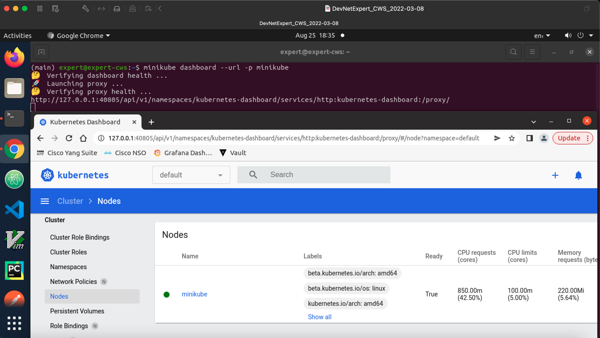

# Kubernetes with Minikube for DevNet Expert

## Introduction

I have created this repository to learn K8s which is short for Kubernetes as there are 8 characters between K and S. The good thing about K8s that we can play with K8s by using minikube, which is basically a lightweight Kubernetes implementation. Therefore, we do not need multiple servers or VMs to run the K8s for testing or learning purpose, we can simply utilise minikube in our DevNet CWS and run a single VM cluster. If you have created your DevNet Expert CWS with the following minimum specification, required for minikube, then you should be good to go. 

-	2 CPUs or more
-	2GB of free memory
-	20GB of free disk space
-	Internet connection
-	Container or virtual machine manager, such as: Docker, Hyperkit, Hyper-V, KVM, Parallels, Podman, VirtualBox, or VMware Fusion/Workstation

For more information to get started with minikube, check out this [link]( https://minikube.sigs.k8s.io/docs/start/).

I also suggest to stop any other docker containers or unnecessary services running to get the best results with minikube. 

Besides the Minikube, there are some other easy ways to get started with Kubernestes, though I found Minikube a simple solution to start with K8s, however you can try any of these out too. 

- [Kind](https://kind.sigs.k8s.io/)
- [Kubeadm](https://github.com/kubernetes/kubeadm)
- [k3s](https://github.com/k3s-io/k3s)
- [Autok3s](https://github.com/cnrancher/autok3s)
- [K0s](https://github.com/k0sproject/k0s)
- [MicroK8s](https://github.com/ubuntu/microk8s)

## Minikube Installation on DevNet Expert CWS (Candidate Work Station)

I am going to be using DevNet Expert CWS in this example but process will be same for Ubuntu 20.04.

#### Step1: Download minikube (v1.23) or latest

Since, I am learning for DevNet Expert, I am going to download the v1.23 as mentioned in the DevNet Expert equipment list [here](https://learningnetwork.cisco.com/s/article/devnet-expert-equipment-and-software-list), but you can download the latest version if you like by replacing `v.1.23.2` with `latest` keyword in the follwing curl command. 

```java
(main) expert@expert-cws:~$ curl -LO https://storage.googleapis.com/minikube/releases/v1.23.2/minikube-linux-amd64
  % Total    % Received % Xferd  Average Speed   Time    Time     Time  Current
                                 Dload  Upload   Total   Spent    Left  Speed
100 65.8M  100 65.8M    0     0  15.1M      0  0:00:04  0:00:04 --:--:-- 15.1M
```

#### Step2: Install minikube in your /usr/local/bin/ folder  

```bash
(main) expert@expert-cws:~$ sudo install minikube-linux-amd64 /usr/local/bin/minikube
(main) expert@expert-cws:~$
```

#### Step3: Verify the minikube installation 

```bash
(main) expert@expert-cws:~$ ls -l /usr/local/bin/ | grep minikube
-rwxr-xr-x 1 root root 69041843 Aug 22 17:12 minikube
(main) expert@expert-cws:~$ 
```

By default, kubectl gets configured to access the kubernetes cluster control plane inside minikube when the minikube start command is executed.

However if kubectl is not installed locally, minikube already includes kubectl which can be used like this:

```s
minikube kubectl -- <kubectl commands>
```

You can either create an alias for `minikube kubectl` or install `kubectl` command line tool for K8s. 

Create an Alias 
```s
alias kubectl="minikube kubectl --"
```

For more infromation, follow this [link](https://minikube.sigs.k8s.io/docs/handbook/kubectl/).

Or you can follow the this [link](https://kubernetes.io/docs/tasks/tools/install-kubectl-linux/) to install `kubectl` on your system, since I am using the DevNet Expert CWS, it has `kubectl` installed already. 

#### Step4: Start minikube with docker driver 

Before you start the minikube, make sure you disable swap `sudo swapoff -a` otherwise you may get undesired results.

Since minikube is a leightweight K8s implementation, therefore it can be started with different drivers options. The recommended one for Ubuntu is Docker. Again if you are working on DevNet Expert CWS, Docker is already installed, however you can install Docker if you do not have it installed. 

Check out this [link](https://minikube.sigs.k8s.io/docs/drivers/) for minikube drivers options. 

```bash
(main) expert@expert-cws:~$ sudo swapoff -a
[sudo] password for expert: 
(main) expert@expert-cws:~$
(main) expert@expert-cws:~$ minikube start --driver=docker
😄  minikube v1.23.2 on Ubuntu 20.04
✨  Using the docker driver based on existing profile
👍  Starting control plane node minikube in cluster minikube
🚜  Pulling base image ...
🏃  Updating the running docker "minikube" container ...
🐳  Preparing Kubernetes v1.22.2 on Docker 20.10.8 ...
🔎  Verifying Kubernetes components...
    ▪ Using image gcr.io/k8s-minikube/storage-provisioner:v5
🌟  Enabled addons: storage-provisioner, default-storageclass
🏄  Done! kubectl is now configured to use "minikube" cluster and "default" namespace by default
(main) expert@expert-cws:~$ 
```
Minukube starts with 2 vCPU and 2048 memory along with docker driver by default if you have docker installed otherwise virtualbox. However, you can override defaults by explicitly specifying the custom CPU, memory and driver as below.

```
$ minikube start --driver=virtualbox --memory 4096 --cpus 4
```

You can also edit existing minikube 
```
$ minikube stop
$ minikube config set memory 4096
$ minikube config set cpus 4
$ minikube start
```

There you go, now you have it minikube installed on your system and you can enjoy running the Kubernetes like a captain 😄. But wait there is more stuff coming along. 

Let's check versions, nodes and cluster information. 

```bash
(main) expert@expert-cws:~$ minikube version
minikube version: v1.23.2
commit: 0a0ad764652082477c00d51d2475284b5d39ceed
```

```bash
(main) expert@expert-cws:~$ minikube status
minikube
type: Control Plane
host: Running
kubelet: Running
apiserver: Running
kubeconfig: Configured

(main) expert@expert-cws:~$ 
```

```bash
(main) expert@expert-cws:~$ kubectl config get-contexts
CURRENT   NAME       CLUSTER    AUTHINFO   NAMESPACE
*         minikube   minikube   minikube   default
```

```bash
(main) expert@expert-cws:~$ minikube service list
|----------------------|---------------------------|--------------|-----|
|      NAMESPACE       |           NAME            | TARGET PORT  | URL |
|----------------------|---------------------------|--------------|-----|
| default              | kubernetes                | No node port |
| kube-system          | kube-dns                  | No node port |
| kubernetes-dashboard | dashboard-metrics-scraper | No node port |
| kubernetes-dashboard | kubernetes-dashboard      | No node port |
|----------------------|---------------------------|--------------|-----|
```

```bash
(main) expert@expert-cws:~$ minikube profile list
|----------|-----------|---------|--------------|------|---------|---------|-------|
| Profile  | VM Driver | Runtime |      IP      | Port | Version | Status  | Nodes |
|----------|-----------|---------|--------------|------|---------|---------|-------|
| minikube | docker    | docker  | 192.168.49.2 | 8443 | v1.22.2 | Running |     1 |
|----------|-----------|---------|--------------|------|---------|---------|-------|
(main) expert@expert-cws:~$ 
```

```bash
(main) expert@expert-cws:~$ kubectl version --short
Client Version: v1.23.3
Server Version: v1.22.2
```

```bash
(main) expert@expert-cws:~$ kubectl version
Client Version: version.Info{Major:"1", Minor:"23", GitVersion:"v1.23.3", GitCommit:"816c97ab8cff8a1c72eccca1026f7820e93e0d25", GitTreeState:"clean", BuildDate:"2022-01-25T21:25:17Z", GoVersion:"go1.17.6", Compiler:"gc", Platform:"linux/amd64"}
Server Version: version.Info{Major:"1", Minor:"22", GitVersion:"v1.22.2", GitCommit:"8b5a19147530eaac9476b0ab82980b4088bbc1b2", GitTreeState:"clean", BuildDate:"2021-09-15T21:32:41Z", GoVersion:"go1.16.8", Compiler:"gc", Platform:"linux/amd64"}
```

```
(main) expert@expert-cws:~$ kubectl version -o yaml
clientVersion:
  buildDate: "2022-01-25T21:25:17Z"
  compiler: gc
  gitCommit: 816c97ab8cff8a1c72eccca1026f7820e93e0d25
  gitTreeState: clean
  gitVersion: v1.23.3
  goVersion: go1.17.6
  major: "1"
  minor: "23"
  platform: linux/amd64
serverVersion:
  buildDate: "2021-09-15T21:32:41Z"
  compiler: gc
  gitCommit: 8b5a19147530eaac9476b0ab82980b4088bbc1b2
  gitTreeState: clean
  gitVersion: v1.22.2
  goVersion: go1.16.8
  major: "1"
  minor: "22"
  platform: linux/amd64

(main) expert@expert-cws:~$ 
```

```bash
(main) expert@expert-cws:~$ kubectl version --client --output=yaml  
clientVersion:
  buildDate: "2022-01-25T21:25:17Z"
  compiler: gc
  gitCommit: 816c97ab8cff8a1c72eccca1026f7820e93e0d25
  gitTreeState: clean
  gitVersion: v1.23.3
  goVersion: go1.17.6
  major: "1"
  minor: "23"
  platform: linux/amd64

(main) expert@expert-cws:~$ 
```

Check the node, it should be one node cluster which acts as master as well as worker

```bash
(main) expert@expert-cws:~$ kubectl get nodes -A
NAME       STATUS   ROLES                  AGE     VERSION
minikube   Ready    control-plane,master   2d23h   v1.22.2
(main) expert@expert-cws:~$ 
```

```bash
(main) expert@expert-cws:~$ minikube node list
minikube	192.168.49.2
(main) expert@expert-cws:~$ 
```

```bash
(main) expert@expert-cws:~$ kubectl cluster-info
Kubernetes control plane is running at https://192.168.49.2:8443
CoreDNS is running at https://192.168.49.2:8443/api/v1/namespaces/kube-system/services/kube-dns:dns/proxy

To further debug and diagnose cluster problems, use 'kubectl cluster-info dump'.
(main) expert@expert-cws:~$ 
```

To check the kubectl config

```bash
(main) expert@expert-cws:~$  minikube kubectl config view
apiVersion: v1
clusters:
- cluster:
    certificate-authority: /home/expert/.minikube/ca.crt
    extensions:
    - extension:
        last-update: Mon, 22 Aug 2022 17:13:16 UTC
        provider: minikube.sigs.k8s.io
        version: v1.23.2
      name: cluster_info
    server: https://192.168.49.2:8443
  name: minikube
contexts:
- context:
    cluster: minikube
    extensions:
    - extension:
        last-update: Mon, 22 Aug 2022 17:13:16 UTC
        provider: minikube.sigs.k8s.io
        version: v1.23.2
      name: context_info
    namespace: default
    user: minikube
  name: minikube
current-context: minikube
kind: Config
preferences: {}
users:
- name: minikube
  user:
    client-certificate: /home/expert/.minikube/profiles/minikube/client.crt
    client-key: /home/expert/.minikube/profiles/minikube/client.key
(main) expert@expert-cws:~$ 
```

#### Step5: Add or Delete addtional worker node (optional)

You can also add or delete additional node to your cluster by using following command.

```bash
(main) expert@expert-cws:~$ minikube node add --worker -p minikube
😄  Adding node m02 to cluster minikube
❗  Cluster was created without any CNI, adding a node to it might cause broken networking.
E0825 18:25:29.199604 1301348 register.go:141] unexpected first step: ""
👍  Starting node minikube-m02 in cluster minikube
E0825 18:25:29.206764 1301348 register.go:141] unexpected first step: ""
🚜  Pulling base image ...
E0825 18:25:29.422322 1301348 register.go:141] unexpected first step: ""
🔥  Creating docker container (CPUs=2, Memory=2200MB) ...- E0825 18:26:02.736603 1301348 register.go:141] unexpected first step: ""

🐳  Preparing Kubernetes v1.22.2 on Docker 20.10.8 .../ E0825 18:26:14.331137 1301348 register.go:141] unexpected first step: ""

🔎  Verifying Kubernetes components...
🏄  Successfully added m02 to minikube!
(main) expert@expert-cws:~$ 
(main) expert@expert-cws:~$ minikube status
minikube
type: Control Plane
host: Running
kubelet: Running
apiserver: Running
kubeconfig: Configured

minikube-m02
type: Worker
host: Running
kubelet: Running

(main) expert@expert-cws:~$ 
(main) expert@expert-cws:~$ 
(main) expert@expert-cws:~$ 
(main) expert@expert-cws:~$ 
(main) expert@expert-cws:~$ minikube node delete minikube-m02 -p minikube
🔥  Deleting node minikube-m02 from cluster minikube
✋  Stopping node "minikube-m02"  ...
🛑  Powering off "minikube-m02" via SSH ...
🔥  Deleting "minikube-m02" in docker ...
💀  Node minikube-m02 was successfully deleted.
(main) expert@expert-cws:~$ 
```
You can also access the minikube dashboard, I will not be covering the Kubernetes dashboard, but you can always run this command to check the K8s WebUI and explore it.

```bash
$ minikube dashboard 
$ minikube dashboard --url -p minikube
```



I have created other markdown files to document some useful definitions and Kubctl commands. I will also be adding how to deploy and application pods, deployments, secrets, services, ingress, volumes, namespaces, and replica sets etc using the K8s yaml config files.

If you like to check apiVersion, kind, namespaces, short names etc. when creating a config file, you can run the follwoing command to check the api resources which provides information for all the api resources. 
```bash
(main) expert@expert-cws:~$ kubectl api-resources
NAME                              SHORTNAMES   APIVERSION                             NAMESPACED   KIND
bindings                                       v1                                     true         Binding
componentstatuses                 cs           v1                                     false        ComponentStatus
configmaps                        cm           v1                                     true         ConfigMap
endpoints                         ep           v1                                     true         Endpoints
events                            ev           v1                                     true         Event
limitranges                       limits       v1                                     true         LimitRange
namespaces                        ns           v1                                     false        Namespace
nodes                             no           v1                                     false        Node
persistentvolumeclaims            pvc          v1                                     true         PersistentVolumeClaim
persistentvolumes                 pv           v1                                     false        PersistentVolume
pods                              po           v1                                     true         Pod
podtemplates                                   v1                                     true         PodTemplate
replicationcontrollers            rc           v1                                     true         ReplicationController
resourcequotas                    quota        v1                                     true         ResourceQuota
secrets                                        v1                                     true         Secret
serviceaccounts                   sa           v1                                     true         ServiceAccount
services                          svc          v1                                     true         Service
mutatingwebhookconfigurations                  admissionregistration.k8s.io/v1        false        MutatingWebhookConfiguration
validatingwebhookconfigurations                admissionregistration.k8s.io/v1        false        ValidatingWebhookConfiguration
customresourcedefinitions         crd,crds     apiextensions.k8s.io/v1                false        CustomResourceDefinition
apiservices                                    apiregistration.k8s.io/v1              false        APIService
controllerrevisions                            apps/v1                                true         ControllerRevision
daemonsets                        ds           apps/v1                                true         DaemonSet
deployments                       deploy       apps/v1                                true         Deployment
replicasets                       rs           apps/v1                                true         ReplicaSet
statefulsets                      sts          apps/v1                                true         StatefulSet
tokenreviews                                   authentication.k8s.io/v1               false        TokenReview
localsubjectaccessreviews                      authorization.k8s.io/v1                true         LocalSubjectAccessReview
selfsubjectaccessreviews                       authorization.k8s.io/v1                false        SelfSubjectAccessReview
selfsubjectrulesreviews                        authorization.k8s.io/v1                false        SelfSubjectRulesReview
subjectaccessreviews                           authorization.k8s.io/v1                false        SubjectAccessReview
horizontalpodautoscalers          hpa          autoscaling/v1                         true         HorizontalPodAutoscaler
cronjobs                          cj           batch/v1                               true         CronJob
jobs                                           batch/v1                               true         Job
certificatesigningrequests        csr          certificates.k8s.io/v1                 false        CertificateSigningRequest
leases                                         coordination.k8s.io/v1                 true         Lease
endpointslices                                 discovery.k8s.io/v1                    true         EndpointSlice
events                            ev           events.k8s.io/v1                       true         Event
flowschemas                                    flowcontrol.apiserver.k8s.io/v1beta1   false        FlowSchema
prioritylevelconfigurations                    flowcontrol.apiserver.k8s.io/v1beta1   false        PriorityLevelConfiguration
ingressclasses                                 networking.k8s.io/v1                   false        IngressClass
ingresses                         ing          networking.k8s.io/v1                   true         Ingress
networkpolicies                   netpol       networking.k8s.io/v1                   true         NetworkPolicy
runtimeclasses                                 node.k8s.io/v1                         false        RuntimeClass
poddisruptionbudgets              pdb          policy/v1                              true         PodDisruptionBudget
podsecuritypolicies               psp          policy/v1beta1                         false        PodSecurityPolicy
clusterrolebindings                            rbac.authorization.k8s.io/v1           false        ClusterRoleBinding
clusterroles                                   rbac.authorization.k8s.io/v1           false        ClusterRole
rolebindings                                   rbac.authorization.k8s.io/v1           true         RoleBinding
roles                                          rbac.authorization.k8s.io/v1           true         Role
priorityclasses                   pc           scheduling.k8s.io/v1                   false        PriorityClass
csidrivers                                     storage.k8s.io/v1                      false        CSIDriver
csinodes                                       storage.k8s.io/v1                      false        CSINode
csistoragecapacities                           storage.k8s.io/v1beta1                 true         CSIStorageCapacity
storageclasses                    sc           storage.k8s.io/v1                      false        StorageClass
volumeattachments                              storage.k8s.io/v1                      false        VolumeAttachment
(main) expert@expert-cws:~$ 
```

To Login to your minukube container 

`$ minikube ssh`
```bash
(main) expert@expert-cws:~$ minikube ssh
Last login: Sun Sep 25 10:56:01 2022 from 192.168.49.1
docker@minikube:~$ ls -la /
total 80
drwxr-xr-x   1 root root 4096 Aug 22 17:12 .
drwxr-xr-x   1 root root 4096 Aug 22 17:12 ..
-rwxr-xr-x   1 root root    0 Aug 22 17:12 .dockerenv
-rw-r--r--   1 root root 1093 Sep 16  2021 Release.key
lrwxrwxrwx   1 root root    7 Apr  1  2021 bin -> usr/bin
drwxr-xr-x   2 root root 4096 Apr 15  2020 boot
drwxr-xr-x   2 root root 4096 Aug 22 17:12 data
drwxr-xr-x  15 root root 4000 Sep 22 10:43 dev
-rw-r--r--   1 root root 3817 Sep 16  2021 docker.key
drwxr-xr-x   1 root root 4096 Sep 22 10:43 etc
drwxr-xr-x   1 root root 4096 Sep 16  2021 home
-rw-r--r--   1 root root   96 Sep 16  2021 kic.txt
drwxr-xr-x   1 root root 4096 Aug 22 17:12 kind
lrwxrwxrwx   1 root root    7 Apr  1  2021 lib -> usr/lib
lrwxrwxrwx   1 root root    9 Apr  1  2021 lib32 -> usr/lib32
lrwxrwxrwx   1 root root    9 Apr  1  2021 lib64 -> usr/lib64
lrwxrwxrwx   1 root root   10 Apr  1  2021 libx32 -> usr/libx32
drwxr-xr-x   2 root root 4096 Apr  1  2021 media
drwxr-xr-x   2 root root 4096 Apr  1  2021 mnt
drwxr-xr-x   1 root root 4096 Aug 22 17:12 opt
dr-xr-xr-x 429 root root    0 Sep 22 10:43 proc
drwx------   1 root root 4096 Aug 22 17:13 root
drwxr-xr-x  12 root root  340 Sep 22 10:43 run
lrwxrwxrwx   1 root root    8 Apr  1  2021 sbin -> usr/sbin
drwxr-xr-x   2 root root 4096 Apr  1  2021 srv
dr-xr-xr-x  13 root root    0 Sep 22 10:43 sys
drwxrwxrwt   5 root root  140 Sep 22 10:43 tmp
drwxr-xr-x   1 root root 4096 Sep 16  2021 usr
drwxr-xr-x  14 root root 4096 Aug 22 17:12 var
docker@minikube:~$ 
```

## References

[Minikube Documentation](https://minikube.sigs.k8s.io/docs/)

[Kubernetes Documentation](https://kubernetes.io/docs/home/)

[Learn Kubernetes Basics](https://kubernetes.io/docs/tutorials/kubernetes-basics/_print/)

## Author

[Muhammad Rafi](https://www.linkedin.com/in/muhammad-rafi-0a37a248/)
